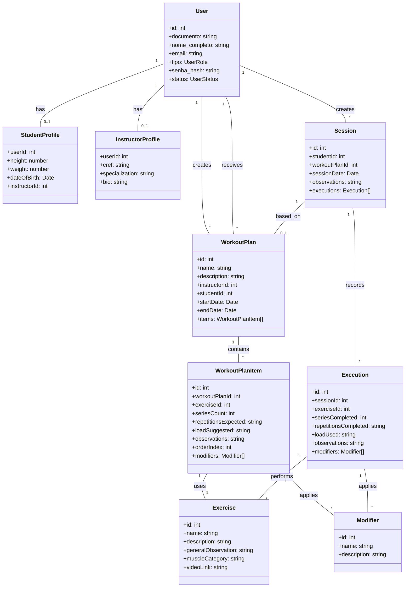

# Extreme Body - Documentação Detalhada

Este documento serve como a fonte única da verdade para todas as regras de negócio, requisitos de sistema, modelo de dados e diagramas relacionados ao projeto Gym Management API.

## 1. Regras de Negócio

(Conteúdo da seção 5 "Regras de Negócio" da documentação do projeto revisada)

## 2. Requisitos de Sistema

(Conteúdo da seção 6 "Requisitos de Sistema" da documentação do projeto revisada)

## 3. Modelo de Dados (Diagrama de Entidade-Relacionamento - ERD)

### Visão Geral
O modelo de dados relacional abaixo é a base para o armazenamento persistente da aplicação. Ele é inicialmente implementado em memória (`inMemoryDB.js`), mas reflete a estrutura de um banco de dados relacional para facilitar futuras migrações.

```mermaid
erDiagram
    USER {
        INT id PK "UUID or Auto-increment"
        VARCHAR(255) documento UK "CPF or other ID, unique"
        VARCHAR(255) nome_completo
        VARCHAR(255) email UK
        VARCHAR(255) tipo "ENUM('Admin', 'Instrutor', 'Aluno')"
        VARCHAR(255) senha_hash
        VARCHAR(50) status "ENUM('Ativo', 'Inativo')"
        DATETIME created_at
        DATETIME updated_at
    }

    STUDENT_PROFILE {
        INT user_id PK,FK "Refers to USER.id"
        DECIMAL(5,2) height "in cm, optional"
        DECIMAL(5,2) weight "in kg, optional"
        DATE date_of_birth "optional"
        INT instructor_id FK "Refers to USER.id (Instrutor), optional"
    }

    INSTRUCTOR_PROFILE {
        INT user_id PK,FK "Refers to USER.id"
        VARCHAR(20) cref UK "Required for Instructors"
        TEXT specialization "optional"
        TEXT bio "optional"
    }

    EXERCISE {
        INT id PK "Auto-increment"
        VARCHAR(255) name UK
        TEXT description "optional"
        TEXT general_observation "optional"
        VARCHAR(100) muscle_category "e.g., Peito, Costas"
        VARCHAR(255) video_link "URL, optional"
        DATETIME created_at
        DATETIME updated_at
    }

    MODIFIER {
        INT id PK "Auto-increment"
        VARCHAR(255) name UK
        TEXT description "optional"
        DATETIME created_at
        DATETIME updated_at
    }

    WORKOUT_PLAN {
        INT id PK "Auto-increment"
        VARCHAR(255) name
        TEXT description "optional"
        INT instructor_id FK "Refers to USER.id (Instrutor)"
        INT student_id FK "Refers to USER.id (Aluno)"
        DATE start_date
        DATE end_date
        DATETIME created_at
        DATETIME updated_at
    }

    WORKOUT_PLAN_ITEM {
        INT id PK "Auto-increment"
        INT workout_plan_id FK
        INT exercise_id FK
        INT series_count
        VARCHAR(50) repetitions_expected "e.g., '8-12', 'AMRAP'"
        VARCHAR(50) load_suggested "e.g., '10kg', '50% 1RM'"
        TEXT observations "optional"
        INT order_index "Order within the plan"
    }

    WORKOUT_PLAN_ITEM_MODIFIER {
        INT workout_plan_item_id PK,FK
        INT modifier_id PK,FK
    }

    SESSION {
        INT id PK "Auto-increment"
        INT student_id FK
        INT? workout_plan_id FK "Optional, refers to WORKOUT_PLAN.id"
        DATETIME session_date
        TEXT observations "optional"
        DATETIME created_at
        DATETIME updated_at
    }

    EXECUTION {
        INT id PK "Auto-increment"
        INT session_id FK
        INT exercise_id FK
        INT series_completed
        VARCHAR(50) repetitions_completed
        VARCHAR(50) load_used
        TEXT observations "optional"
        DATETIME created_at
        DATETIME updated_at
    }

    EXECUTION_MODIFIER {
        INT execution_id PK,FK
        INT modifier_id PK,FK
    }

    USER ||--o{ STUDENT_PROFILE : "has"
    USER ||--o{ INSTRUCTOR_PROFILE : "has"
    USER ||--o{ WORKOUT_PLAN : "creates"
    USER ||--o{ WORKOUT_PLAN : "receives"
    WORKOUT_PLAN ||--o{ WORKOUT_PLAN_ITEM : "contains"
    WORKOUT_PLAN_ITEM ||--o{ EXERCISE : "uses"
    WORKOUT_PLAN_ITEM ||--o{ WORKOUT_PLAN_ITEM_MODIFIER : "applies"
    WORKOUT_PLAN_ITEM_MODIFIER ||--o{ MODIFIER : "is_a"
    USER ||--o{ SESSION : "has"
    SESSION ||--o{ WORKOUT_PLAN : "based_on"
    SESSION ||--o{ EXECUTION : "records"
    EXECUTION ||--o{ EXERCISE : "performs"
    EXECUTION ||--o{ EXECUTION_MODIFIER : "applies"
    EXECUTION_MODIFIER ||--o{ MODIFIER : "is_a"
```

## 4. Diagrama de Classes (Alto Nível)


