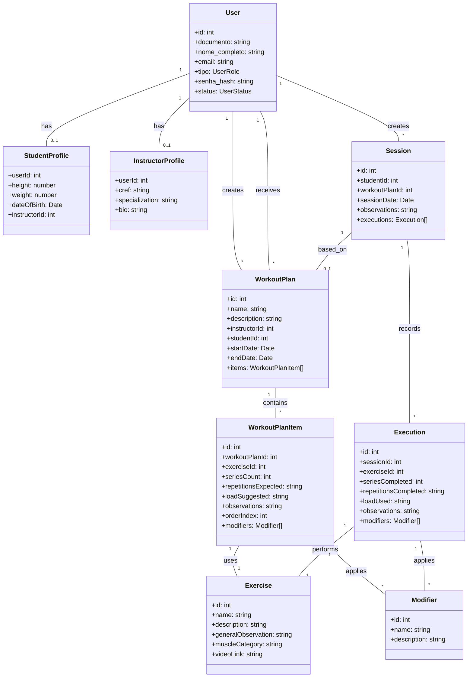

# Extreme Body - Documentação Detalhada

Este documento serve como a fonte única da verdade para todas as regras de negócio, requisitos de sistema, modelo de dados e diagramas relacionados ao projeto Gym Management API.

## 1. Regras de Negócio

(Conteúdo da seção 5 "Regras de Negócio" da documentação do projeto revisada)

## 2. Requisitos de Sistema

### 2.1. Requisitos Funcionais

1.  **RF001 - Gestão de Usuários e Perfis:** O sistema deve permitir o gerenciamento completo de usuários e seus perfis associados.
    *   RF001.1 - `Admins` devem poder criar, visualizar, atualizar e deletar qualquer tipo de usuário (`Admin`, `Instrutor`, `Aluno`).
    *   RF001.2 - `Instrutores` devem poder criar e gerenciar seus `Alunos` associados.
    *   RF001.3 - Usuários (`Instrutor`, `Aluno`) devem poder visualizar e atualizar seus próprios dados, com restrições (ex: não podem alterar seu próprio `tipo` ou `status`).
    *   RF001.4 - A criação de um `Aluno` requer um `StudentProfile` (perfil de aluno), e a criação de um `Instrutor` requer um `InstructorProfile` (perfil de instrutor).

2.  **RF002 - Autenticação de Usuários:** O sistema deve fornecer um meio seguro para os usuários se autenticarem.
    *   RF002.1 - Um endpoint de `login` deve aceitar `email` e `password` e, em caso de sucesso, retornar um token de acesso (JWT).

3.  **RF003 - Autorização baseada em Papéis:** O acesso aos recursos da API deve ser restrito com base no tipo de usuário (`Admin`, `Instrutor`, `Aluno`).
    *   RF003.1 - Endpoints devem ser protegidos, exigindo um token JWT válido.
    *   RF003.2 - A lógica de negócio deve aplicar regras de permissão granulares (ex: um `Instrutor` só pode ver os planos de seus próprios alunos).

4.  **RF004 - Gestão de Catálogos de Treino:** O sistema deve permitir o gerenciamento dos catálogos de `Exercícios` e `Modificadores de Set`.
    *   RF004.1 - `Admins` e `Instrutores` devem poder criar, atualizar e visualizar `Exercícios` e `Modificadores`.
    *   RF004.2 - A exclusão de um item do catálogo só deve ser permitida se ele não estiver vinculado a nenhum `Plano de Treino` ou `Execução` existente, garantindo a integridade dos dados.

5.  **RF005 - Gestão de Planos de Treino:** O sistema deve permitir a criação e o gerenciamento de planos de treino detalhados.
    *   RF005.1 - `Admins` e `Instrutores` podem criar planos, associando um `Aluno`, um `Instrutor`, e uma lista de `Exercícios` com metas específicas (séries, repetições, carga).
    *   RF005.2 - A visualização e edição de planos devem seguir regras de autorização (ex: `Aluno` só pode ver seu próprio plano).

6.  **RF006 - Registro de Sessões de Treino:** O sistema deve permitir o registro do que foi efetivamente realizado em um treino.
    *   RF006.1 - `Alunos` (ou `Instrutores`/`Admins` em seu nome) podem registrar uma `Sessão`, contendo uma ou mais `Execuções` de exercícios.
    *   RF006.2 - Cada `Execução` deve detalhar o desempenho real (séries completadas, repetições, carga utilizada).

7.  **RF007 - Visualização de Histórico de Treino:** O sistema deve permitir que usuários autorizados visualizem o histórico de treinos e os detalhes de sessões anteriores de forma enriquecida.
    *   RF007.1 - Exibir uma lista de todas as sessões registradas pelo usuário (Aluno) ou por seus alunos (Instrutor), incluindo a data da sessão, o plano de treino associado (se houver) e um resumo das execuções. A lista deve ser passível de filtros por aluno, plano de treino ou data.
    *   RF007.2 - Ao selecionar uma sessão, exibir os detalhes completos, incluindo:
        *   Informações do `Aluno` que realizou a sessão.
        *   Informações do `Plano de Treino` associado (se houver), incluindo o `Instrutor` responsável.
        *   Para cada `Execução de Exercício`: o `Exercício` completo (do catálogo), as `séries`, `repetições` e `carga` efetivas, `observações` e os `Modificadores de Set` completos aplicados.
    *   RF007.3 - A visualização do histórico deve respeitar as regras de autorização: `Admin` pode visualizar o histórico de qualquer `Aluno`; `Instrutor` pode visualizar o histórico de seus `Alunos`; `Aluno` pode visualizar apenas o seu próprio histórico.

## 3. Modelo de Dados (Diagrama de Entidade-Relacionamento - ERD)

### 3.1. Visão Geral
O modelo de dados relacional abaixo é a base para o armazenamento persistente da aplicação. Ele é inicialmente implementado em memória (`inMemoryDB.js`), mas reflete a estrutura de um banco de dados relacional para facilitar futuras migrações.

> **Nota de Implementação:** No modelo em memória, as tabelas de junção (muitos-para-muitos) como `WORKOUT_PLAN_ITEM_MODIFIER` e `EXECUTION_MODIFIER` são simplificadas como arrays de IDs (`modifier_ids`) dentro das entidades `WORKOUT_PLAN_ITEM` e `EXECUTION`, respectivamente. Da mesma forma, `WORKOUT_PLAN_ITEM` é implementado como um array aninhado `items` dentro de `WORKOUT_PLAN`, e `EXECUTION` como um array `executions` dentro de `SESSION`.

### 3.2. Diagrama ER
```mermaid
erDiagram
    USER {
        INT id PK "UUID or Auto-increment"
        VARCHAR(255) documento UK "CPF or other ID, unique"
        VARCHAR(255) nome_completo
        VARCHAR(255) email UK
        VARCHAR(255) tipo "ENUM('Admin', 'Instrutor', 'Aluno')"
        VARCHAR(255) senha_hash
        VARCHAR(50) status "ENUM('Ativo', 'Inativo')"
        DATETIME created_at
        DATETIME updated_at
    }

    STUDENT_PROFILE {
        INT user_id PK,FK "Refers to USER.id"
        DECIMAL(5,2) height "in cm, optional"
        DECIMAL(5,2) weight "in kg, optional"
        DATE date_of_birth "optional"
        INT instructor_id FK "Refers to USER.id (Instrutor), optional"
    }

    INSTRUCTOR_PROFILE {
        INT user_id PK,FK "Refers to USER.id"
        VARCHAR(20) cref UK "Required for Instructors"
        TEXT specialization "optional"
        TEXT bio "optional"
    }

    EXERCISE {
        INT id PK "Auto-increment"
        VARCHAR(255) name UK
        TEXT description "optional"
        TEXT general_observation "optional"
        VARCHAR(100) muscle_category "e.g., Peito, Costas"
        VARCHAR(255) video_link "URL, optional"
        DATETIME created_at
        DATETIME updated_at
    }

    MODIFIER {
        INT id PK "Auto-increment"
        VARCHAR(255) name UK
        TEXT description "optional"
        DATETIME created_at
        DATETIME updated_at
    }

    WORKOUT_PLAN {
        INT id PK "Auto-increment"
        VARCHAR(255) name
        TEXT description "optional"
        INT instructor_id FK "Refers to USER.id (Instrutor)"
        INT student_id FK "Refers to USER.id (Aluno)"
        DATE start_date
        DATE end_date
        DATETIME created_at
        DATETIME updated_at
    }

    WORKOUT_PLAN_ITEM {
        INT id PK "Auto-increment"
        INT workout_plan_id FK
        INT exercise_id FK
        INT series_count
        VARCHAR(50) repetitions_expected "e.g., '8-12', 'AMRAP'"
        VARCHAR(50) load_suggested "e.g., '10kg', '50% 1RM'"
        TEXT observations "optional"
        INT order_index "Order within the plan"
    }

    WORKOUT_PLAN_ITEM_MODIFIER {
        INT workout_plan_item_id PK,FK
        INT modifier_id PK,FK
    }

    SESSION {
        INT id PK "Auto-increment"
        INT student_id FK
        INT? workout_plan_id FK "Optional, refers to WORKOUT_PLAN.id"
        DATETIME session_date
        TEXT observations "optional"
        DATETIME created_at
        DATETIME updated_at
    }

    EXECUTION {
        INT id PK "Auto-increment"
        INT session_id FK
        INT exercise_id FK
        INT series_completed
        VARCHAR(50) repetitions_completed
        VARCHAR(50) load_used
        TEXT observations "optional"
        DATETIME created_at
        DATETIME updated_at
    }

    EXECUTION_MODIFIER {
        INT execution_id PK,FK
        INT modifier_id PK,FK
    }

    USER ||--o{ STUDENT_PROFILE : "has"
    USER ||--o{ INSTRUCTOR_PROFILE : "has"
    USER ||--o{ WORKOUT_PLAN : "creates"
    USER ||--o{ WORKOUT_PLAN : "receives"
    WORKOUT_PLAN ||--o{ WORKOUT_PLAN_ITEM : "contains"
    WORKOUT_PLAN_ITEM ||--o{ EXERCISE : "uses"
    WORKOUT_PLAN_ITEM ||--o{ WORKOUT_PLAN_ITEM_MODIFIER : "applies"
    WORKOUT_PLAN_ITEM_MODIFIER ||--o{ MODIFIER : "is_a"
    USER ||--o{ SESSION : "has"
    SESSION ||--o{ WORKOUT_PLAN : "based_on"
    SESSION ||--o{ EXECUTION : "records"
    EXECUTION ||--o{ EXERCISE : "performs"
    EXECUTION ||--o{ EXECUTION_MODIFIER : "applies"
    EXECUTION_MODIFIER ||--o{ MODIFIER : "is_a"
```

## 4. Diagrama de Classes (Alto Nível)


